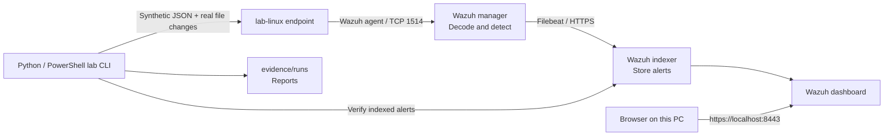

# Wazuh SIEM Home Lab

A reproducible blue-team lab with a Wazuh manager, indexer, dashboard, and one
monitored Linux container. Practice collecting telemetry, writing detections,
investigating alerts, and documenting evidence for a security portfolio.

**Start here:** follow [Quick start](#quick-start-windows-powershell), run the tests,
then use [the portfolio guide](docs/PORTFOLIO.md). No Splunk account or paid license
is needed. This project uses **Wazuh 4.14.8**, pinned across all four services.

**Verified locally:** [validation results](docs/VALIDATION.md) record a successful
deployment and full test run, with all 13 checks passing and 14 indexed alerts.

## What you get

- Four containers managed with Docker Compose.
- Unique local passwords, TLS between central services, password-based agent enrollment.
- Five custom detections, including repeated-login correlation.
- A real file integrity monitoring (FIM) exercise inside the endpoint container.
- A test runner that checks the Wazuh rule engine **and indexed alerts**.
- Timestamped JSON and Markdown evidence reports; positive and benign controls.
- Instructions for daily operation, troubleshooting, investigations and portfolio presentation.

The default lab monitors its **Linux container**, not your Windows computer or
every device on your home LAN. PowerShell/authentication/web test logs are
**synthetic fixtures**, not actual endpoint attacks. File creation, modification
and deletion are real operations on disposable files in the endpoint container.
See [optional endpoint expansion](docs/ENDPOINTS.md) for Windows/home LAN monitoring.

## Architecture



Only the dashboard is published to the host, on **127.0.0.1:8443**. Manager,
enrollment, indexer and API ports remain inside this project's Docker network.
No Docker socket, host system directory, privileged container or host networking
is used. The Docker network can access the internet; it is not an air gap.

All project files, generated configuration and reports live in this folder.
Persistent database and endpoint data use Docker-managed named volumes, which
Docker Desktop stores in its own Linux disk. Docker images also live in Docker's
storage. Copying this project folder alone does **not** back up those volumes.

## Requirements

| Requirement | For this lab |
| --- | --- |
| Host | Windows with Docker Desktop + WSL 2, or Linux with Docker Engine |
| CPU architecture | x86-64 / AMD64 (bundled agent image requirement) |
| Docker resources | At least 4 CPUs and 8 GB RAM; allocate 10-12 GB for comfortable use |
| Host RAM | 16 GB minimum practical recommendation; 32 GB is comfortable |
| Disk | At least 50 GB free for images/data; monitor Docker's disk separately |
| Python | Python 3.10+; standard library only, no `pip install` needed |
| Compose | Docker Compose v2 or newer (`docker compose`) |
| Connectivity | Initial image downloads and certificate tool download require internet |
| Kernel | `vm.max_map_count` at least `262144` |

These central-component prerequisites follow the [official Docker guide](https://documentation.wazuh.com/current/deployment-options/docker/wazuh-container.html).
The project deliberately pins a documented release; it does not auto-upgrade.

### Check Docker and the kernel

Start Docker Desktop, select **Linux containers**, and wait for the engine to run:

```powershell
docker version
docker compose version
wsl -d docker-desktop -u root sysctl vm.max_map_count
```

If the last value is below 262144, set it for the running WSL kernel:

```powershell
wsl -d docker-desktop -u root sysctl -w vm.max_map_count=262144
```

Recheck after a Windows/WSL restart; this command is not a persistent setting.
If your Docker Desktop version does not expose the `docker-desktop` distribution,
use the [current Docker/Wazuh host instructions](https://documentation.wazuh.com/current/deployment-options/docker/wazuh-container.html#docker-host-requirements).

On native Linux:

```bash
sudo sysctl -w vm.max_map_count=262144
# For persistence, create /etc/sysctl.d/99-wazuh.conf containing:
# vm.max_map_count=262144
# Then run sudo sysctl --system.
```

## Quick start: Windows PowerShell

On this PC, open PowerShell in the existing lab folder. On a new machine, clone
the repository first:

```powershell
git clone https://github.com/DickaRaditya/SIEM-HOMELAB.git
cd SIEM-HOMELAB
```

From the project folder, run the following commands. They work even when
PowerShell script execution is restricted:

```powershell
python scripts/lab.py setup
python scripts/lab.py start
python scripts/lab.py credentials
```

`setup` downloads images, generates passwords and certificates, prepares the
configuration, and creates the endpoint log/FIM directories. It can take several
minutes and several GB of downloads. Interrupted downloads reuse completed
layers when you rerun `setup`. Re-running it retains existing credentials.

`start` waits up to 10 minutes for container health and checks agent connection.
It prints `Ready` only after those checks. If it fails, follow troubleshooting
below; a running container alone does not prove a working SIEM.

Open **[https://localhost:8443](https://localhost:8443)**:

- Username: **admin**.
- Password: shown by `python scripts/lab.py credentials`.
- A browser certificate warning is expected: this lab uses a private CA and
  internal service names. Continue only for this local lab address. Do not disable
  certificate checking globally or install the lab CA as a system-wide trusted CA.

The password is stored in local `.env`. Do not upload it or show it in screenshots.
The environment file, certificates, runtime configuration and raw evidence are
excluded by `.gitignore`. Docker administrators can inspect container secrets;
this is a local learning deployment, not a hardened production secrets system.

Optional PowerShell wrapper (same actions):

```powershell
.\lab.ps1 setup
.\lab.ps1 start
.\lab.ps1 test
```

If scripts are blocked, use the Python commands above. No execution-policy change
is required. On Linux use `python3 scripts/lab.py ...` from this project folder.

## Test the entire lab

Once `start` succeeds:

```powershell
python scripts/lab.py status
python scripts/lab.py test
```

The test normally takes 2-5 minutes after startup. It:

1. Checks that `lab-linux` is registered and active.
2. Runs positive, benign and correlation tests through `wazuh-logtest`.
3. Writes 14 synthetic events to `/lab/logs/events.json` inside the endpoint.
4. Waits for rules 100101-100105 in the indexer's `wazuh-alerts-*` indices.
5. Creates, modifies and deletes one unique file under `/lab/monitored`, waiting
   for each genuine FIM alert (554, 550 and 553) before the next operation.
6. Checks that benign controls do not generate an indexed alert and the indexer
   is not red, then saves the result.

Every run has a unique ID, so old alerts cannot satisfy a new run. Test IP
`192.0.2.10` is documentation data; the runner does not contact it. The command
and traversal strings are log content; neither is executed or sent to a server.

| Exercise | Expected rule | Level | Evidence type |
| --- | --- | --- | --- |
| Failed login | 100101 | 5 | Synthetic JSON |
| Repeated failed logins from one source/run | 100102 | 10 | Stateful correlation of synthetic JSON |
| Successful root login | 100103 | 7 | Synthetic JSON |
| Encoded PowerShell command string | 100104 | 10 | Synthetic JSON; PowerShell is not executed |
| Directory traversal string | 100105 | 8 | Synthetic JSON; no HTTP request |
| File added / modified / deleted | 554 / 550 / 553 | Built-in Wazuh severity | Real endpoint file operations |
| Ordinary user login / Get-Date string / normal URL | No indexed alert | 0 parent rule | Benign controls |

The correlation rule uses a 60-second window and a configured frequency of five.
The runner submits eight failures to reliably cross Wazuh's correlation counter
threshold; do not infer an exact five-event firing threshold without inspecting
your rule-engine output. It keys on both source IP and test run to isolate runs.

Reports appear in:

```text
evidence/runs/<UTC-timestamp>-<unique-id>/
  REPORT.md       Human-readable pass/fail evidence
  result.json     Machine-readable check results
  events.jsonl    Submitted synthetic fixtures
  alerts.json     Actual indexed Wazuh alerts for this run
```

A nonzero exit code means failure. Review `REPORT.md` rather than assuming all
steps completed. FIM uses Linux container storage to avoid Windows bind-mount
filesystem notification limitations.

For a fast detection-only check after editing rules:

```powershell
docker compose restart wazuh.manager
python scripts/lab.py start
python scripts/lab.py rule-test
```

`rule-test` does not produce indexed dashboard alerts. `test` validates the full
collection-to-indexer path. Neither automatically validates your browser UI.

## Find alerts in the dashboard

1. Open **Agents / Endpoints** and confirm `lab-linux` is **Active**.
2. Open **Threat hunting / Events** (or Discover with `wazuh-alerts-*`).
3. Set the time picker to **Last 1 hour** and refresh.
4. Paste a filter from [docs/QUERIES.md](docs/QUERIES.md).
5. Expand an alert and inspect `rule.id`, `rule.description`, `agent.name`,
   `data.lab_run_id`, `full_log` and `timestamp`.
6. For FIM, inspect `syscheck.path`, `syscheck.event`, hashes and `syscheck.diff`
   when present. The FIM alerts do not contain `data.lab_run_id`; filter by path.

Menu labels may vary across dashboard versions. A successful automated report
proves alerts were indexed; save dashboard screenshots yourself for the portfolio.

## Everyday commands

| Task | Command |
| --- | --- |
| Prepare first installation / retry a partial download | `python scripts/lab.py setup` |
| Start and wait for readiness | `python scripts/lab.py start` |
| Check containers, cluster and agents | `python scripts/lab.py status` |
| Run all exercises and export evidence | `python scripts/lab.py test` |
| Show local dashboard login | `python scripts/lab.py credentials` |
| Show recent service logs | `python scripts/lab.py logs` |
| Validate source configuration without a running engine | `python scripts/lab.py validate` |
| Stop and retain data | `python scripts/lab.py stop` |

`stop` runs `docker compose down` **without** volume removal. Restart with `start`.
Images, volumes, credentials and reports remain. The containers use
`restart: unless-stopped`; after a Docker/PC restart they may resume if you did
not stop the lab. Stop it when you need the RAM for other work.

To inspect one service manually:

```powershell
docker compose logs --tail 100 wazuh.manager
docker compose logs --tail 100 wazuh.indexer
docker compose logs --tail 100 lab.endpoint
```

Do not edit `.env` to rotate passwords on an existing cluster: its security
database retains the old values. Follow [Wazuh's password rotation procedure](https://documentation.wazuh.com/current/deployment-options/docker/changing-default-password.html)
and update all dependent services together. Do not publish `docker compose config`
output: interpolation includes credentials.

## Troubleshooting

| Symptom | What to check |
| --- | --- |
| Cannot connect to Docker / named pipe | Start Docker Desktop; wait for Linux engine readiness; run `docker info`. |
| Pull fails with EOF/reset/timeout | Retry `setup`; check Docker registry access, proxy and available disk. Do not switch to unpinned images. |
| Indexer exits / virtual memory error | Set `vm.max_map_count` to at least 262144 in the Docker host kernel. |
| Exit code 137 / very slow startup | Allocate more Docker/WSL RAM; stop other large workloads; use `docker stats --no-stream`. |
| Port 8443 is already allocated | Stop the conflicting application or change only the dashboard host port in `compose.yml`; use that port in your browser. |
| Dashboard says not ready | Run `status` and indexer/manager logs. Wait for initialization; do not delete volumes to mask an error. |
| Indexer cluster is yellow | One-node replicas can cause yellow; red means unavailable primary shards and fails the test. |
| Agent absent / disconnected | Inspect agent and manager logs; check enrollment password and the internal Docker network. |
| New custom rules do not apply | Edit `config/local_rules.xml`, restart manager, run `start`, then `rule-test` and `test`. Rules are copied at container startup. |
| No events visible | Use Last 1 hour, the right index pattern, `agent.name: "lab-linux"`, refresh, then compare with `alerts.json`. |
| FIM missing | Check endpoint logs and `/lab/monitored`; baseline/scheduled scans run every 30 seconds. Use the test runner's unique files. |
| Credentials rejected after editing `.env` | Restore original values or perform coordinated rotation; setup never silently resets the security database. |
| Linux bind-file permission errors | Ensure generated config/certificates are readable by the container's service user; do not make private keys world-readable as a blanket fix. |

Useful manager diagnostics:

```powershell
docker compose exec -T wazuh.manager /var/ossec/bin/wazuh-analysisd -t
docker compose exec -T wazuh.manager /var/ossec/bin/agent_control -lc
docker compose exec -T lab.endpoint cat /var/ossec/var/run/wazuh-agentd.state
```

Container stdout logs are rotated (3 x 10 MB per container). Indexed alerts,
manager log volumes and test reports are **not** automatically expired. Monitor
disk use with `docker system df` and archive selected evidence. This small lab
does not enable automated retention or a backup schedule.

## Reset or remove the lab

Normally use `stop`, which preserves evidence and data. For a deliberate **fresh,
empty cluster**, first stop the lab and back up anything you want to keep:

```powershell
python scripts/lab.py stop
# DESTRUCTIVE: removes this Compose project's named volumes (alerts, agents, databases).
docker compose down --volumes
# Keep .env and runtime to reuse the same local credentials and certificates.
python scripts/lab.py setup
python scripts/lab.py start
```

This does not delete reports in `evidence/runs`. To generate new credentials too,
remove `.env` and `runtime` only **after** removing the old lab volumes. Then run
`setup` again. Never use a global Docker prune to reset this project: it can affect
unrelated workloads. The fixed project name is `siem-homelab`; run only one copy
on a given Docker engine at a time.

## Portfolio workflow

Use [docs/PORTFOLIO.md](docs/PORTFOLIO.md) and fill in
[docs/INCIDENT-REPORT-TEMPLATE.md](docs/INCIDENT-REPORT-TEMPLATE.md).
Publish configuration, rule logic, your explanation, sanitized results and
screenshots. Demonstrate both a useful detection and a false-positive limitation.
Only claim tests you actually ran. Raw test evidence is ignored by Git so you can
review it before copying selected results into `evidence/published/`.

Suggested résumé wording after completing the exercises:

> Built a containerized Wazuh SIEM lab with a monitored Linux endpoint; authored
> custom JSON detections and correlated repeated authentication failures; validated
> the collection-to-indexer pipeline and file integrity alerts with reproducible
> tests and documented investigation evidence.

The lab does not demonstrate production deployment, actual Windows process
telemetry, malware execution or incident containment. Inventory is enabled on
the endpoint; its SCA/rootcheck and automatic response are disabled. Manager
vulnerability feed detection is disabled to keep the baseline exercise focused;
enable and validate it separately if you expand the project.

## Project layout

```text
compose.yml                    Four-service deployment
generate-certs.yml              Wazuh certificate generator
lab.ps1                        Optional Windows command wrapper
scripts/lab.py                 Setup, health checks, tests and evidence export
scripts/fetch_upstream.py       Maintainer-only pinned source refresh utility
config/agent.conf              Endpoint collection and FIM settings
config/local_rules.xml         Custom detections
vendor/wazuh/                  Pinned upstream config, license, SHA-256 manifest
docs/                          Queries, endpoint expansion and portfolio guides
tests/                         CLI regression tests
evidence/published/            Reviewed artifacts you choose to publish
evidence/runs/                 Generated raw test evidence (ignored)
runtime/                       Local generated config and certificates (ignored)
.env                           Generated passwords (ignored)
```

## References and attribution

- [Official Wazuh Docker deployment](https://documentation.wazuh.com/current/deployment-options/docker/wazuh-container.html)
- [Pinned Wazuh Docker source](https://github.com/wazuh/wazuh-docker/tree/v4.14.8)
- [Custom Wazuh rules](https://documentation.wazuh.com/current/user-manual/ruleset/rules/custom.html)
- [Rule testing](https://documentation.wazuh.com/current/user-manual/ruleset/testing.html)
- [Rules syntax](https://documentation.wazuh.com/current/user-manual/ruleset/ruleset-xml-syntax/rules.html)
- [File integrity monitoring](https://documentation.wazuh.com/current/user-manual/capabilities/file-integrity/index.html)

See [THIRD_PARTY.md](THIRD_PARTY.md) and [LICENSE](LICENSE) for provenance and licensing.
